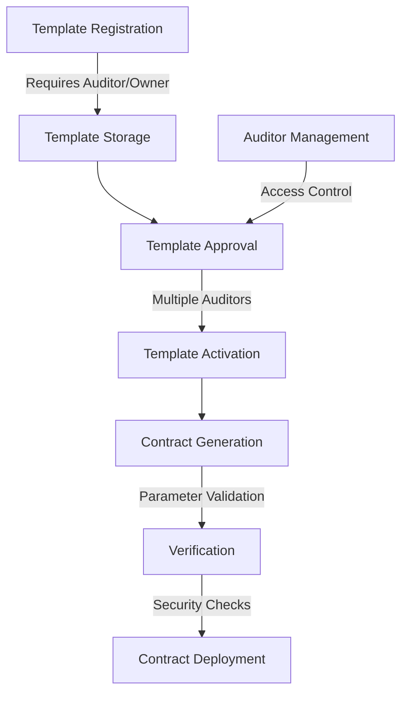

# SafeForge Contract Generator

A secure platform for generating standardized Clarity smart contracts without writing code. SafeForge prioritizes security through rigorous verification checks and audited templates.

## Overview

SafeForge democratizes smart contract creation by providing a parameter-based approach to generating secure, audited smart contracts. The platform maintains a library of pre-verified templates that users can customize for common use cases like fungible tokens, NFTs, and DAOs.

Key features:
- Template-based contract generation
- Multi-signature security auditing
- Parameter validation and verification
- Immutable record of generated contracts
- Version control for templates

## Architecture

The system is built around a core contract that manages template registration, auditing, and contract generation.



## Contract Documentation

### SafeForge Core Contract

The central registry managing all template and contract generation operations.

**Key Components:**
- Template management
- Auditor governance
- Contract generation pipeline
- Security verification system

**Access Control:**
- Contract Owner: Can manage auditors and transfer ownership
- Auditors: Can register/update templates and approve versions
- Users: Can generate contracts from approved templates

## Getting Started

### Prerequisites
- Clarinet
- Stacks wallet for contract interaction

### Installation
1. Clone the repository
2. Install dependencies
3. Deploy the contract using Clarinet

### Basic Usage

```clarity
;; Register a new template (Auditor/Owner only)
(contract-call? .safeforge-core register-template
    "Simple Token"
    "Basic fungible token template"
    parameter-schema
    contract-template)

;; Generate a contract from template
(contract-call? .safeforge-core generate-contract
    template-id
    parameters)
```

## Function Reference

### Administrative Functions

```clarity
(transfer-ownership (new-owner principal))
(add-auditor (auditor principal))
(remove-auditor (auditor principal))
(update-min-approvals (new-min-approvals uint))
```

### Template Management

```clarity
(register-template (name (string-ascii 64)) (description (string-utf8 500)) (parameter-schema (list ...)) (contract-template (string-utf8 10000)))
(update-template (template-id uint) (parameter-schema (list ...)) (contract-template (string-utf8 10000)))
(approve-template (template-id uint) (version uint) (comments (string-utf8 500)))
```

### Contract Generation

```clarity
(generate-contract (template-id uint) (parameters (list ...)))
```

### Read-Only Functions

```clarity
(get-template-details (template-id uint))
(get-template-version (template-id uint) (version uint))
(get-generated-contract (generation-id uint))
(get-approval-status (template-id uint) (version uint))
```

## Development

### Testing
Run the test suite using Clarinet:
```bash
clarinet test
```

### Local Development
1. Start a local Clarinet console:
```bash
clarinet console
```
2. Deploy the contract:
```clarity
(contract-call? .safeforge-core ...)
```

## Security Considerations

### Limitations
- Templates must be approved by multiple auditors before activation
- Parameter validation is strictly enforced
- Contract generation includes automatic security verification

### Best Practices
1. Always verify template approval status before generating contracts
2. Review generated contract parameters carefully
3. Ensure sufficient auditor approvals before using templates
4. Monitor template versions and updates

### Critical Security Points
- Multi-signature approval requirement
- Parameter boundary validation
- Template versioning system
- Immutable generation records